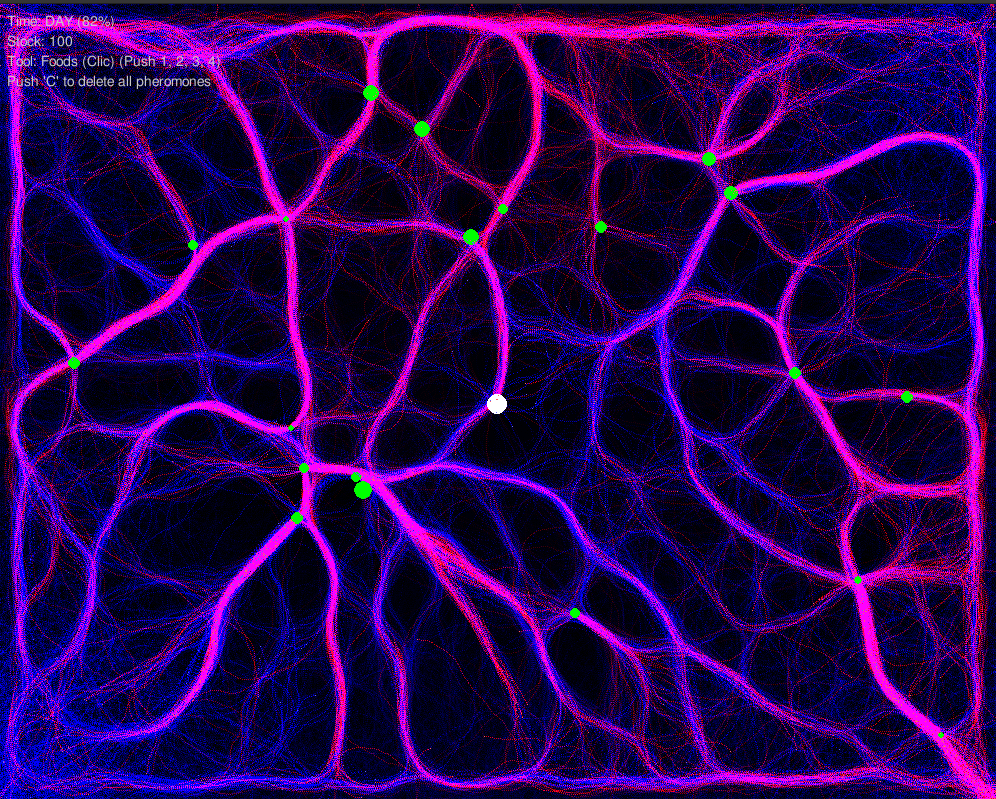
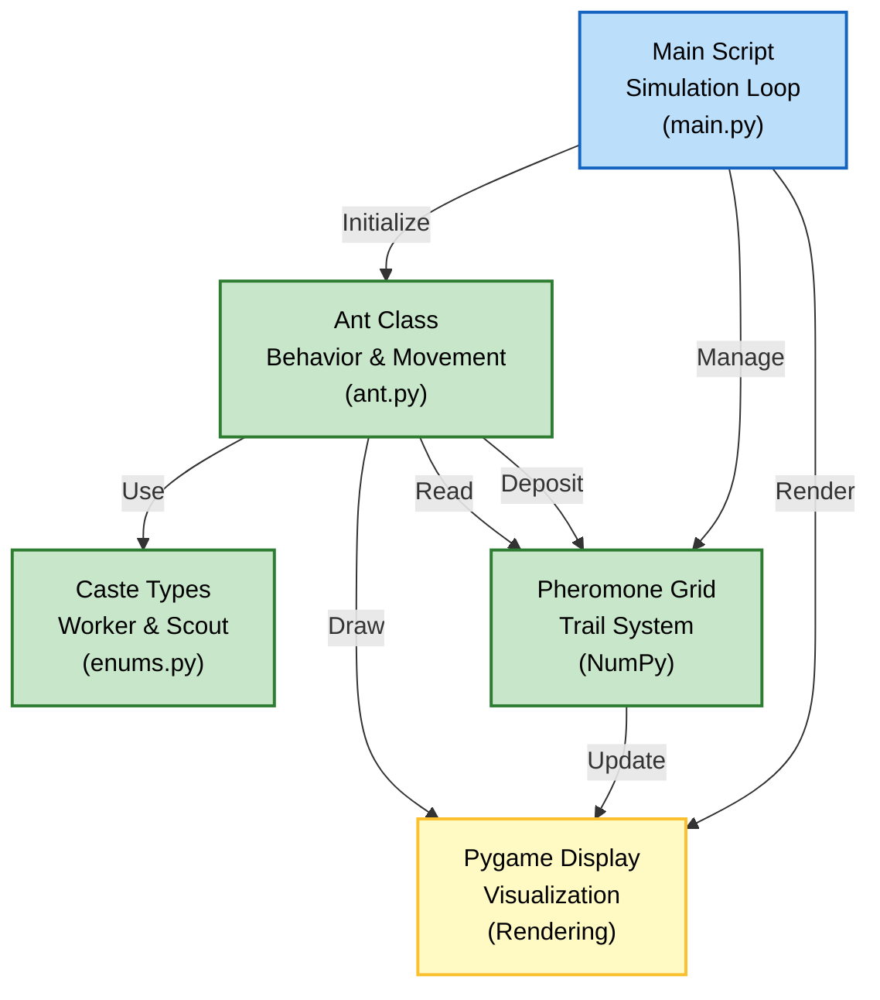

# ACO

Ant Colony Optimization algorithm visualization and simulation

## Author

- [@0xS4cha](https://github.com/0xS4cha)

## Result



## Description

This project is a Python project focused on understanding and implementing the Ant Colony Optimization (ACO) algorithm using Pygame for real-time visualization. The simulation demonstrates how artificial ants exhibit emergent intelligent behavior through pheromone trails to find optimal paths between their nest and food sources.



## Installation

### Requirements

```bash
pip install pygame numpy pydantic matplotlib
```

## Usage

### Running the Simulation

Simply run the main script:

```python
python main.py
```

### Configuration Parameters

You can modify the simulation parameters directly in `main.py`:

```python
# Display settings
WIDTH, HEIGHT = 1000, 800
FPS = 60

# Colony settings
ANT_COUNT = 5000
FOODS_COUNT = 20

# Algorithm parameters
ALPHA = 1.5         # Pheromone importance
BETA = 2.0          # Heuristic importance (vision)
GAMMA = 0.01        # Random exploration noise

# Pheromone settings
EVAPORATION_DAY = 0.99
EVAPORATION_NIGHT = 0.995
DIFFUSION_RATE = 0.05

# Ant behavior
SENSOR_ANGLE = math.pi / 4  # 45 degrees field of view
```

## Features

### Ant Castes

The simulation includes two types of ants with different characteristics:

| Caste | Speed | Can Carry Food | Vision Multiplier |
|-------|-------|----------------|-------------------|
| **Worker** | 2.0 | ✅ Yes | 1.0 |
| **Scout** | 3.5 | ❌ No | 1.5 |

- **Workers (90%)**: Collect food and bring it back to the nest
- **Scouts (10%)**: Explore the environment and mark paths with pheromones

### Pheromone System

The simulation uses a dual-pheromone system:

- **Blue Trail (Home Pheromone)**: Left by ants searching for food
- **Red Trail (Food Pheromone)**: Left by ants carrying food back to nest

Pheromones evaporate over time and diffuse slightly to create smooth trails.

### Day/Night Cycle

The simulation includes a day/night cycle that affects:
- Pheromone evaporation rates
- Ant vision capabilities
- Visual rendering (background color changes)

## Algorithm

The ACO algorithm implementation follows these principles:

1. **Initialization**: Spawn ants at the nest with random orientations
2. **Movement**: Each ant uses three sensors to detect pheromones
3. **Decision Making**: Movement direction is chosen based on:
   - Pheromone strength (α factor)
   - Heuristic information - direct vision (β factor)
   - Random exploration (γ factor)
4. **Pheromone Deposit**: Ants leave pheromone trails that decay over distance
5. **Evaporation**: Pheromones gradually evaporate to prevent saturation
6. **Diffusion**: Trails slightly spread to create smoother paths

### Mathematical Model

The probability of choosing a direction is calculated as:

```
P(direction) = (τ^α) × (η^β) + γ
```

Where:
- `τ` = pheromone intensity
- `η` = heuristic (visibility of target)
- `α` = pheromone importance
- `β` = heuristic importance
- `γ` = exploration noise

## Controls

- **Mouse Click**: Add obstacles/walls (if implemented)
- **ESC**: Quit simulation

## Visualization

Colors in the simulation:

- **White**: Nest (colony home)
- **Green**: Food sources
- **Light Blue**: Ants without food
- **Light Red**: Ants carrying food
- **Blue Trails**: Pheromones leading home
- **Red Trails**: Pheromones leading to food

## License

This project is licensed under the MIT License - see the LICENSE file for details.
